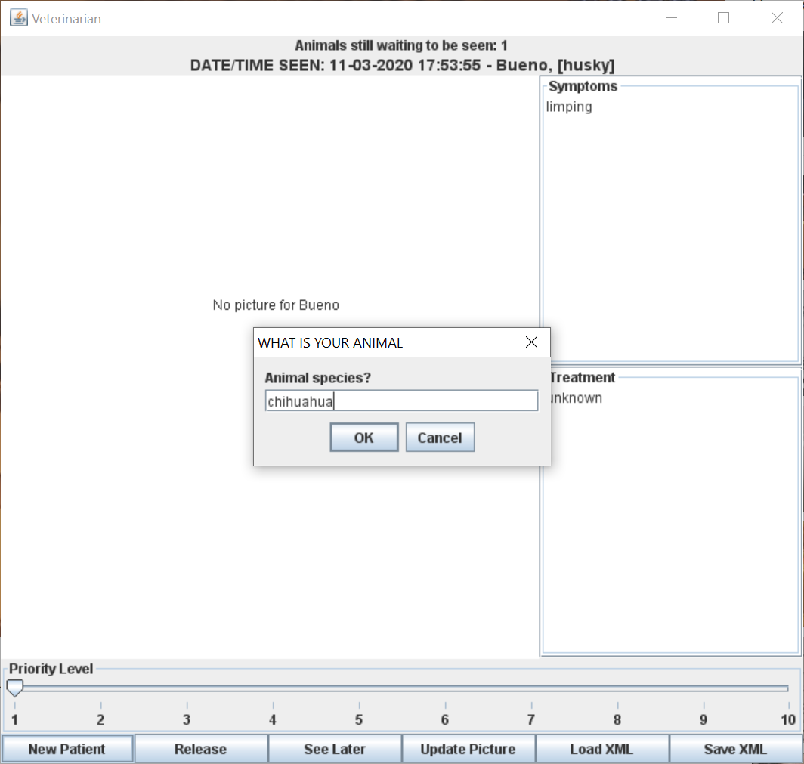

# Vet

Veterinarians can use this software to manage their patient flows. It allows:

+ Add, release, and bump patients for later examinations.
+ Set patient's priority.
+ Load from and save to XML.
+ Add illness symptoms and treatments.
+ Add a profile picture.

